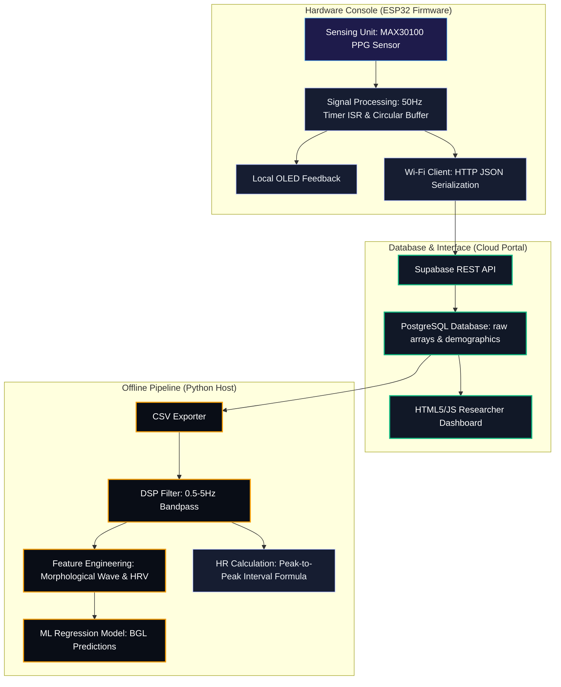
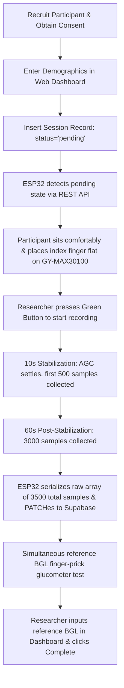

# 3.3.2 Software System Architecture

The software architecture of the tabletop non-invasive blood glucose monitoring system comprises four sequential processing stages implemented in firmware on the ESP32 microcontroller, together with a central database and dashboard cloud environment, and an offline data processing and machine learning pipeline executed in Python on a host computer.

---

# 3.3.3 Two-Mode Operation

The tabletop hardware platform operates in two distinct modes: **Data Collection Mode** (used during the clinical trials to compile the database) and **Inference Mode** (deployed for non-invasive prediction once the machine learning regression model is validated). 

Table 3.2 outlines the operational differences between these two modes.

### Table 3.2: Comparison of Data Collection and Prediction Operating Modes

| Attribute | Data Collection Mode (Research DAQ) | Prediction Mode (Clinical Deployment) |
| :--- | :--- | :--- |
| **Primary Function** | Record raw physiological signals and save reference values to build the ML training dataset. | Predict BGL using on-device TinyML model; calculate HR directly using peak interval formula. |
| **Sensor Operation** | 50 Hz sampling of MAX30100 IR LED, buffering 3,500 samples in RAM. | 50 Hz sampling of MAX30100 IR LED, buffering 3,500 samples in RAM. |
| **Signal Processing** | Discards first 500 samples (stabilization); serializes raw 3,500 array without filtering. | Discards first 500 samples; cleans raw signal; extracts HRV & wave features; runs peak-to-peak HR calculation. |
| **Supabase Interface** | Polling view for pending ID; PATCHes raw PPG text array to `ppg_sessions` table. | Optional. Can log session metrics and prediction outcomes to cloud table. |
| **Reference Glucometer** | **Required**. Finger-prick BGL measurement is taken and entered via the Web Dashboard. | **Not Required**. Reference measurement is bypassed; prediction is entirely non-invasive. |
| **OLED Display** | Displays: Participant ID + elapsed scan time + "SAVED OK - Enter BGL". | Displays: Calculated HR (bpm) + Predicted Blood Glucose Level (mg/dL). |
| **Tactile Buttons** | Green = Trigger 70s Scan; Red = Reset / Next Session. | Green = Trigger 70s Scan; Red = Reset / Next Patient. |

---

# 3.3.4 On-Device Inference Mode Workflow (Deployment)

When the device is flashed with the inference firmware image, BGL estimation is performed entirely locally on the ESP32. The step-by-step workflow is structured as follows:

1. **Finger Placement**: The patient places their index finger flat and motionless on the tabletop console's exposed MAX30100 sensor, maintaining a relaxed, static arm posture on the table surface.
2. **PPG Sampling (70s Scan)**: The researcher presses the Green button to start. The console samples the sensor at 50 Hz (3,500 total points):
   * **Stabilization (0s to 10s)**: The device buffers the first 500 samples while the automatic gain control (AGC) settles, ignoring them for feature calculations.
   * **Acquisition (10s to 70s)**: The device captures the remaining 3,000 active raw IR samples in a static array.
3. **Signal Preprocessing & Heart Rate Calculation**:
   * The firmware applies a digital bandpass filter to clean the 3,000 active samples, removing baseline drift.
   * A peak-detection algorithm identifies individual systolic peaks in the waveform.
   * The device calculates the average Heart Rate (HR) directly from the peak-to-peak Inter-Beat Intervals (IBIs) using the statistical formula:
     $$\text{HR (bpm)} = \frac{60,000}{\text{mean}(IBI \text{ in ms})}$$
4. **On-Device Feature Generation & Model Inference**:
   * The firmware calculates specific signal features (e.g. pulse width, crest time, and HRV metrics) from the filtered wave.
   * These features are passed as an input vector into the **TinyML regression model** (e.g. TensorFlow Lite Micro) compiled directly on the ESP32.
   * The TinyML model executes local inference to output the predicted Blood Glucose Level (BGL in mg/dL).
5. **Local Results Output**: The computed Heart Rate and predicted BGL are output in real time on the SSD1306 OLED display (e.g., `HR: 72 bpm`, `BGL: 112 mg/dL`), providing immediate, painless feedback.

---

# 3.4.2 Software System Components

The non-invasive tabletop blood glucose monitoring system comprises three distinct pipeline environments: the on-device firmware (C++ running on the ESP32-NodeMCU 32S microcontroller), the central database & cloud interface (Supabase PostgreSQL and HTML5/JavaScript researcher dashboard), and the offline data processing and machine learning pipeline (Python, executed on a host computer).

Table 3.3 summarises the software tools, frameworks, and libraries used across the tabletop system pipeline.

### Table 3.3: Software Tools and Libraries

| Tool/Library | Version | Environment | Role in this Project |
| :--- | :--- | :--- | :--- |
| **Python** | 3.12+ | Offline (Host PC) | Primary language for digital signal processing, feature engineering, and model training. |
| **pandas** | 2.x | Offline (Host PC) | Merging demographic data, processing semicolon-separated arrays, and structuring CSV exports. |
| **numpy** | 1.24+ | Offline (Host PC) | Array manipulation, signal transformations, and numerical calculation for morphological features. |
| **neurokit2** | 0.2+ | Offline (Host PC) | Cleaning raw PPG, detecting systolic peaks, computing heart rate, and extracting heart rate variability (HRV) metrics. |
| **scipy** | 1.11+ | Offline (Host PC) | Applying bandpass digital filters (0.5 to 5 Hz Butterworth) and conducting spectral analysis (power spectral density). |
| **scikit-learn** | 1.3+ | Offline (Host PC) | Implementing regression models (Random Forest, Gradient Boosting, SVR), data splitting, and evaluation metrics (MAE, RMSE, $R^2$). |
| **matplotlib & seaborn** | 3.7+ | Offline (Host PC) | Plotting cleaned PPG waveforms, systolic peaks, prediction scatter plots, and Bland-Altman error charts. |
| **ESP32 C++ (Arduino Core)**| 2.x | On-Device (ESP32) | Firmware managing SSD1306 OLED display, MAX30100 hardware settings, button interrupts, and Wi-Fi HTTP client routines. |
| **Supabase Client SDK** | 2.x | Cloud / Dashboard | Real-time database client allowing the JavaScript dashboard to insert, update, and read records. |
| **PostgreSQL** | 15+ | Cloud / Database | Cloud relational database managing participant demographics tables and raw PPG signal sessions. |

---

## 3.5 Dataset Preparation

This section describes the complete data acquisition pipeline from the clinical tabletop sensor measurement and simultaneous glucometer reference collection to the final preprocessed feature dataset used for machine learning.

### 3.5.1 Data Collection Protocol

Data collection will be conducted as a cross-sectional clinical pilot study at the outpatient endocrinology clinic of the **Obafemi Awolowo University (OAU) Teaching Hospitals Complex, Ile-Ife, Nigeria**. Participants diagnosed with Type 2 Diabetes Mellitus (T2DM), as well as healthy controls, will be recruited following informed consent and ethical approval clearance.

The tabletop non-invasive data collection procedure is structured as follows:

1. **Participant Registration**: The researcher uses the mobile-responsive Web Dashboard to record the participant's demographic profile (age, gender, weight, height, and years since T2DM diagnosis).
2. **Session Dispatch**: Setting this profile creates a database record with a `pending` status. The tabletop console—polling the database view every 3 seconds—detects this record and displays the participant ID (e.g. `P001`) and the target state on its OLED display.
3. **PPG Acquisition**: The participant rests their arm comfortably on the table surface and places their index finger flat on the exposed GY-MAX30100 sensor. The researcher presses the **Green Button** on the console:
   * **Stabilization (10s)**: The first 10 seconds of the scan (500 samples) are designated for sensor automatic gain control (AGC) and finger pressure stabilization. These samples are subsequently discarded during offline processing.
   * **Post-Stabilization Recording (60s)**: The device captures the remaining 60 seconds (3,000 samples) of the optical PPG signal. Together, these two phases comprise the total 70-second scan window (3,500 samples total at 50 Hz).
4. **Cloud Upload**: On completion, the ESP32 automatically constructs a JSON array and PATCHes the raw 3,500-sample array directly to Supabase.
5. **Reference Blood Glucose Measurement**: Immediately following the optical scan, the clinical researcher performs a standard capillary finger-prick blood test using a calibrated reference glucometer (e.g. Accu-Chek). This reference Blood Glucose Level (BGL) is typed into the Web Dashboard, updating the database record status to `completed`.

To cover a diverse physiological range, readings are collected across three distinct metabolic windows:
* **Fasting**: Pre-breakfast/morning state.
* **1-Hour Post-Prandial**: One hour after a standard carbohydrate meal.
* **2-Hour Post-Prandial**: Two hours after a standard carbohydrate meal.

---

### 3.5.2 Database Schema and Data Export Format

The database hosted on Supabase links participant demographics with their corresponding raw PPG waveforms. Table 3.4 outlines the structured schema of the compiled dataset exported for machine learning.

### Table 3.4: Dataset Feature Structure (Exported CSV)

| Feature Name | Data Type | Source | Measurement Unit / Encoding | Description |
| :--- | :--- | :--- | :--- | :--- |
| `session_id` | UUID | Supabase Table | Hexadecimal String | Unique session database primary key |
| `participant_id` | Varchar | Supabase Table | Alphanumeric (e.g., `P001`) | Anonymized participant research code |
| `age` | Integer | Registration | Years | Age of the participant |
| `gender` | Varchar | Registration | `Male` / `Female` | Biological gender of participant |
| `weight_kg` | Numeric | Registration | Kilograms (kg) | Participant body weight |
| `height_cm` | Numeric | Registration | Centimeters (cm) | Participant height |
| `years_on_t2dm` | Integer | Registration | Years | Duration of Type 2 Diabetes diagnosis |
| `session_kind` | Varchar | Dashboard | `Fasting` / `1hr_post_prandial` / `2hr_post_prandial` | Metabolic state during measurement |
| `bgl_mgdl` | Numeric | Reference test | Milligrams per deciliter (mg/dL) | **Ground-truth BGL target** (reference glucometer) |
| `ppg_data` | Text Array | MAX30100 | Semicolon (`;`) separated integers | **3,500 raw Infrared readings** captured at 50Hz |

---

### 3.5.3 Data Preprocessing and Feature Extraction

The exported database records are processed offline using Python to convert the raw 3,500-sample arrays into robust feature vectors:

1. **Signal Truncation**: The first 500 samples (representing the 10-second optical stabilization window) are discarded. The remaining **3,000 samples** (representing 60 seconds of stable PPG signal) are used for feature extraction.
2. **Filtering**: Baseline wander caused by respiration is removed using a 2nd-order Butterworth bandpass filter (cutoffs at 0.5 Hz and 5 Hz) via `scipy.signal`.
3. **Systolic Peak Detection**: The `neurokit2` peak detection algorithm is applied to locate systolic peaks in the filtered PPG waveform.
4. **Feature Engineering**:
   * **Heart Rate Variability (HRV)**: SDNN, RMSSD, and mean heart rate are calculated from detected peak intervals to capture autonomic nervous system activity.
   * **Morphological Wave Features**: Systolic amplitude, pulse area, crest time, and pulse duration are extracted.
   * **Demographics Merging**: Participant BMI (calculated from height and weight) and diabetic history duration are merged with the extracted PPG features to construct the final input vector.

---

### 3.5.4 Machine Learning Regression Framework

The primary task is modeled as a continuous regression framework. The machine learning model inputs the merged PPG morphological, HRV, and demographic feature vector to output the predicted Blood Glucose Level ($y$ in mg/dL). 

The target variable is represented by:
$$y = \text{bgl\_mgdl} \quad (\text{range: } 60\text{ to } 350\text{ mg/dL})$$

Model evaluation is performed using Leave-One-Subject-Out (LOSO) cross-validation to assess generalizability across new subjects, utilizing Mean Absolute Error (MAE), Root Mean Squared Error (RMSE), and Coefficient of Determination ($R^2$) metrics.
